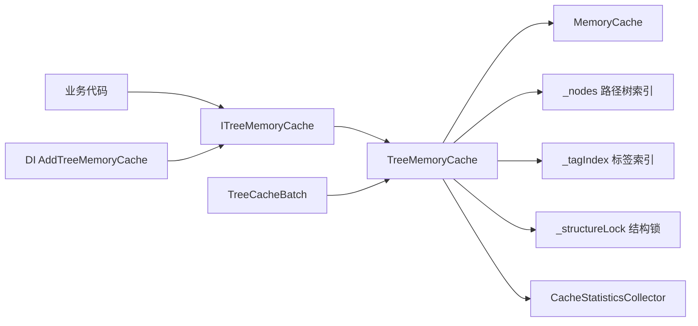
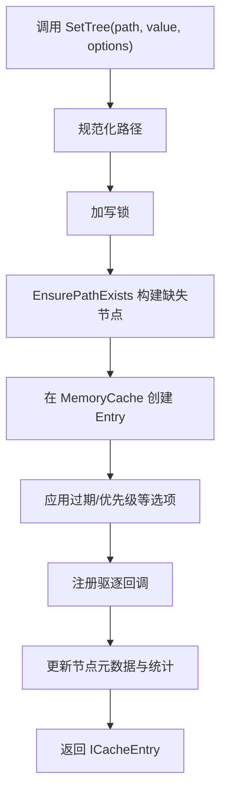
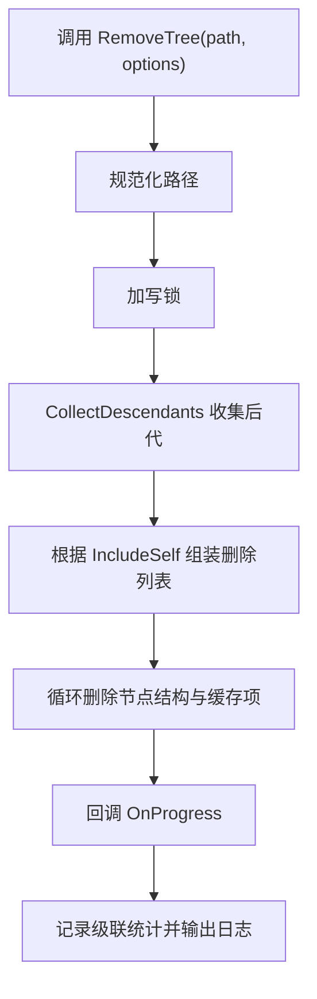

# TreeMemoryCache 说明文档

TreeMemoryCache 是对 `Microsoft.Extensions.Caching.Memory` 的树形能力扩展。  
它在保留 `IMemoryCache` 原生能力的基础上，支持基于路径层级的组织、查询、批量操作和级联删除。

## 1. 核心功能

- 树形路径缓存：使用 `:` 作为层级分隔符，例如 `Line:6:Upward:Stations`
- 级联删除：删除父节点时自动删除所有后代节点
- 层级查询：支持查询直接子节点与全部后代节点
- 路径模式匹配：支持 `*` 通配符匹配路径段
- 批量操作：通过 `TreeCacheBatch` 一次性提交多条变更
- 运行统计：命中、未命中、级联删除次数、平均访问耗时等
- 依赖注入：提供 `IServiceCollection` 扩展方法快速接入

## 2. 适用场景

- 需要按业务层级组织缓存，例如「线路 → 方向 → 站点」
- 需要按子树整体失效，而不是按单 Key 删除
- 需要一次性执行一批缓存变更，减少中间态

## 3. 架构图



## 4. 核心流程图

### 4.1 SetTree 写入流程



### 4.2 RemoveTree 级联删除流程



## 5. 目录与关键类型

- `ITreeMemoryCache.cs`：对外主接口
- `TreeMemoryCache.cs`：核心实现，包含树结构维护、删除、查询、统计
- `TreeCacheBatch.cs`：批量操作对象
- `TreeRemoveOptions.cs`：级联删除选项
- `CacheStatistics.cs`：统计数据模型
- `ServiceCollectionExtensions.cs`：依赖注入扩展

## 6. 快速开始

### 6.1 直接使用

```csharp
using Microsoft.Extensions.Caching.Memory;
using TreeMemoryCache;

using var cache = new TreeMemoryCache();

var entry = cache.SetTree("Line:6:Upward:Stations", new[] { "A", "B", "C" });
entry.Dispose();

if (cache.TryGetTree<string[]>("Line:6:Upward:Stations", out var stations))
{
    Console.WriteLine(string.Join(",", stations!));
}
```

### 6.2 依赖注入使用

```csharp
using Microsoft.Extensions.DependencyInjection;
using TreeMemoryCache;

var services = new ServiceCollection();

services.AddTreeMemoryCache(options =>
{
    options.SizeLimit = 10_000;
});

var provider = services.BuildServiceProvider();
var cache = provider.GetRequiredService<ITreeMemoryCache>();
```

## 7. 常用 API

### 7.1 写入与读取

- `SetTree<T>(path, value, options)`：按树路径写入
- `TryGetTree<T>(path, out value)`：按路径读取并类型检查

### 7.2 树结构查询

- `GetChildPaths(path)`：获取直接子节点
- `GetDescendantPaths(path)`：获取所有后代节点
- `GetPathsByPattern(pattern)`：通配符匹配，示例 `Line:*:Upward:*`

### 7.3 删除能力

- `Remove(path)`：删除单个路径
- `RemoveTree(path, options)`：级联删除子树
- `RemoveTreeAsync(path, ct)`：异步逐个删除并返回删除路径流
- `RemoveByTag(tag)`：按标签删除（当前实现中仅在索引存在数据时生效）

### 7.4 批量操作

```csharp
using var batch = cache.CreateBatch();
batch.Set("Line:6:New", "new-value")
     .Remove("Line:6:Old")
     .RemoveTree("Line:8");
batch.Execute();
```

## 8. 路径规范

- 推荐仅使用 `:` 作为层级分隔符
- 路径会被规范化处理：会去掉首尾空白和首尾 `:`
- 通配符匹配按路径段进行，`*` 只匹配单个段位

## 9. 统计与观测

通过 `GetStatistics()` 获取以下数据：

- `TotalNodeCount`：当前树节点总数
- `TotalCacheSize`：估算缓存大小总和
- `HitCount` / `MissCount`：命中与未命中次数
- `CascadeDeleteCount`：级联删除次数
- `AverageAccessTime`：平均访问耗时
- `NodeCountByRoot`：每个根路径的节点数量

## 10. 重要使用注意事项

- `SetTree` 返回的是 `ICacheEntry`，必须 `Dispose()` 才会真正提交到 `MemoryCache`
- 删除树结构时会同时移除内部节点索引与底层缓存项
- 并发安全依赖 `ReaderWriterLockSlim` 与并发字典共同保证
- 标签相关能力已预留索引结构；若业务需要完整标签写入能力，可在此基础上扩展

## 11. 已实现功能清单

- 已实现：树路径写入、读取、父子关系维护
- 已实现：同步/异步级联删除
- 已实现：路径模式匹配、子节点/后代查询
- 已实现：批量操作封装与执行
- 已实现：基础统计聚合与 DI 集成
